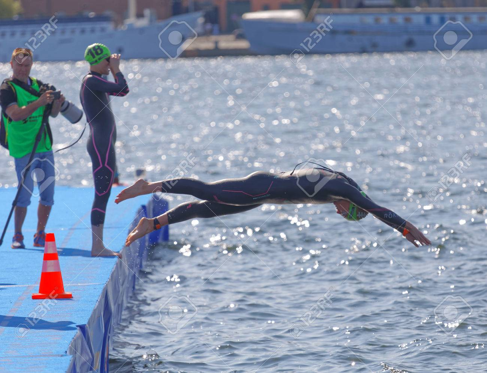
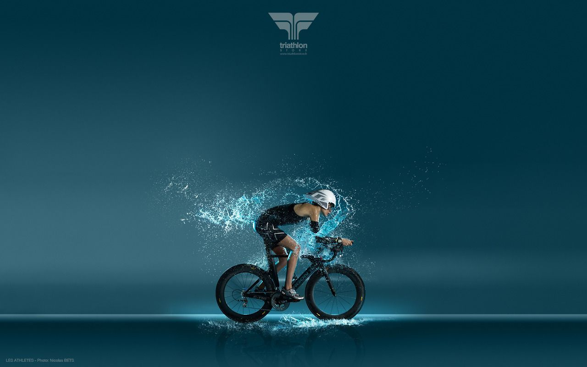

# Adaptive Triathlon Interface Based on Emotion Detection 🧠💪

This project is developed as part of the course **Advanced Interactive Technologies**. It demonstrates an **adaptive user interface** that responds to real-time **facial emotion detection** using the user's webcam. Based on the detected emotion, the interface dynamically updates its content to motivate and guide triathletes through personalized workouts, tips, and music.

---

## 🎯 What It Does

The web application uses `face-api.js` to detect the user’s facial expressions (`happy`, `sad`, `neutral`) and updates the UI accordingly with:

- 🎽 Personalized triathlon training plans (🏊 swim, 🚴 bike, 🏃 run)
- 🎵 Music suggestions and playlists (via embedded YouTube links)
- 💬 Motivational quotes and tips tailored to the mood
- 🎨 Dynamic background and visuals to match the emotion

---

## 🔧 Technologies Used

- `HTML`, `CSS`, `JavaScript`
- [`face-api.js`](https://github.com/justadudewhohacks/face-api.js) (TensorFlow.js wrapper for face detection and expressions)
- YouTube embedded video links
- Webcam video stream (via `navigator.mediaDevices`)
- Local hosting via **Live Server** in Visual Studio Code

---

## 📸 Screenshots & Demo

📷 Real-time facial expression detection via webcam  
🎥 Emotion-based adaptive interface rendering (content, media, and background)

👉 [Watch the Demo Video](https://www.youtube.com/watch?v=r_8jcSU6kNc)

### 🖼️ Triathlon-Themed Interface Preview

#### 🧘 Swim Mode (Sad)


#### 🚴 Bike Mode (Happy)


#### 🏃 Run Mode (Neutral)


---

## 🚀 How to Run Locally

1. **Clone this repo:**
   ```bash
   git clone https://github.com/YourUsername/Adaptive-Triathlon-Interface.git

